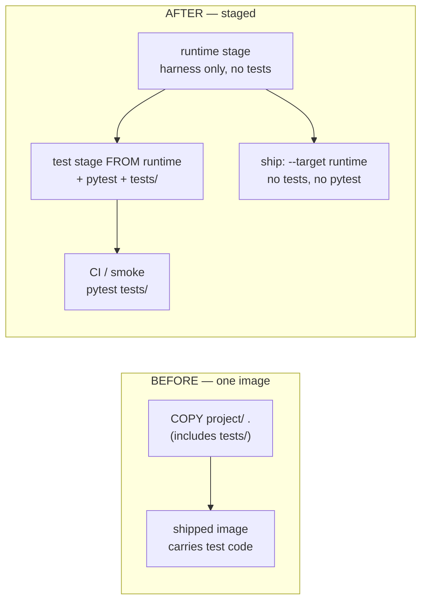

# Shared Test Infrastructure on a Multi-Stage Build

## Summary

Split the harness Docker build into a `runtime` stage that ships with no test
code and no test dependencies, and a `test` stage layered on top that adds
pytest and the suite for CI/dev. On that base, consolidate the duplicated test
bootstrap into shared infra, isolate the pricing test from committed registry
data, and make `pytest tests/` the single runner.

## Problem Frame

Today `Dockerfile` does `COPY project/ .`, which copies `project/tests/` into the
shipped image — production carries test code. The suite was kept dependency-free
(hand-rolled `__main__` runners, no pytest) specifically to avoid shipping a test
dependency, which costs the suite pytest's diagnostics, fixtures, and discovery.

Two more frictions compound it. The `_load()` import bootstrap — which exists to
dodge `harness/__init__.py`'s eager `from harness.cli import main` — is copied
byte-for-byte into both `project/tests/test_cost.py` and
`project/tests/test_sync_models.py`, so the two drift the moment one is touched.
And `test_providers_load_pricing_from_registry` asserts against the live committed
registry ("after we fill TOMLs"), coupling a unit test to whatever provider rates
happen to be on disk, even though `DEEPAGENTS_PROVIDERS_DIR` exists to point tests
at a fixture registry.

A test stage built on top of the runtime stage lets pytest live only where tests
run, removing the "don't ship pytest" constraint that forced all three
workarounds.

## Key Decisions

- **Multi-stage build is the spine.** A `runtime` stage holds the shippable
  harness; a `test` stage extends it with pytest and tests. This is what makes
  test code removable from production — by build target, not by self-restraint.
- **pytest lives only in the test stage.** Because it never enters the shipped
  image, adopting pytest (and `conftest.py` fixtures) no longer conflicts with a
  clean production image.
- **In-image validation is preserved.** The test stage is `FROM` runtime, so
  running the suite against the test image still exercises the real runtime layer
  — the import-cycle / package-split check the smoke step exists for keeps working.
- **`pytest tests/` becomes the one runner.** Discovery replaces the hardcoded
  per-file invocation in the smoke scripts.

## Requirements

**Image packaging**

- R1. The Dockerfile is multi-stage with a `runtime` stage containing the harness
  venv and project code but no test code and no test-only dependencies.
- R2. A `test` stage builds `FROM` the `runtime` stage, adding pytest and the
  `tests/` tree.
- R3. A bare `docker build` (no `--target`) produces the `runtime` image; the test
  image is built explicitly with `--target test`.
- R4. The shipped image contains no files under `tests/` and no importable pytest.

**Shared test infrastructure**

- R5. The `_load()` import bootstrap exists once in shared test infra, imported by
  both test modules rather than copied into each.
- R6. A fixture points `DEEPAGENTS_PROVIDERS_DIR` at a known fixture registry so
  registry-dependent tests do not depend on committed provider rates.
- R7. `test_providers_load_pricing_from_registry` uses that fixture instead of the
  live committed registry.

**Runner and scripts**

- R8. `pytest tests/` is the canonical run command; discovery replaces naming
  individual test files.
- R9. `smoke` runs against the `test` image via `pytest tests/` and no longer
  lists test files by name.
- R10. `verify` and `run-docker` target the `runtime` image.
- R11. The `.ps1` and `.sh` script pairs stay in sync (existing repo convention).
- R12. The hand-rolled `__main__` standalone runners are removed from both test
  files; pytest is the only runner. (They existed only to avoid shipping pytest, a
  need the test stage removes.)

## Acceptance Examples

- AE1. **Covers R3, R4.** An image built with no `--target` has no `tests/`
  directory, and `python3 -c "import pytest"` inside it fails.
- AE2. **Covers R2, R9.** An image built with `--target test` runs `pytest tests/`,
  which discovers both existing test modules and passes.
- AE3. **Covers R6, R7.** The pricing-registry test passes even when the committed
  registry is empty or wrong, because the fixture supplies its own registry.

## Scope Boundaries

**Deferred for later (separate ideas built on this spine):**
- Expanding coverage to untested modules — model routing, loaders, REPL args
  (ideation R4).
- A CI workflow that builds the test stage and runs the suite on every PR
  (ideation R2).

**Outside this change's identity:**
- No change to the trust boundary; this does not add sandboxing (the boundary
  stays the container, per `docs/milestones/mvp.md` §5).

## Dependencies / Assumptions

- Assumes pytest is acceptable as a *test-stage* dependency, never a runtime one.
- Assumes a test stage built `FROM` runtime validates runtime imports adequately
  (the import-cycle smoke remains meaningful when run there).
- Requires restructuring the current wholesale `COPY project/ .` so the runtime
  stage excludes `tests/`.

## Outstanding Questions

**Deferred to planning:**
- How the runtime stage excludes `tests/` — selective `COPY` vs build-context
  split vs removal.
- Whether the fixture registry is a committed fixture directory or generated per
  test via a temp dir.
- Where the pytest version is pinned — inline in the test stage vs a
  `requirements-dev.txt`.
- Whether to add a bare-`runtime` import smoke (no test layer) to catch a runtime
  import that the test layer accidentally satisfies.
