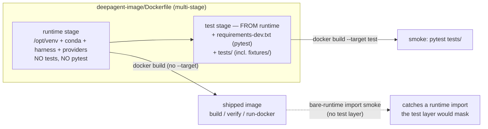

# feat: Shared Test Infrastructure on a Multi-Stage Build

## Summary

Split `deepagent-image/Dockerfile` into a `runtime` stage that ships harness-only —
no test code, no test dependencies — and a `test` stage layered `FROM runtime` that
adds pytest and `tests/`. On that spine: deduplicate the byte-for-byte `_load()`
bootstrap into shared test infra, point the pricing-registry test at a committed
fixture registry instead of the live committed rates, drop the hand-rolled
`__main__` standalone runners, and make `pytest tests/` the single runner.

The multi-stage split is what makes test code removable from production *by build
target* rather than by self-restraint — which removes the "don't ship pytest"
constraint that forced all three current workarounds.

---

## Problem Frame

`deepagent-image/Dockerfile` does a single `COPY project/ .`, so `project/tests/`
lands in the shipped image — production carries test code. To avoid shipping a test
dependency, the suite was kept pytest-free (hand-rolled `__main__` runners), which
costs it pytest's diagnostics, fixtures, and discovery.

Two frictions compound it:

- The `_load()` import bootstrap is copied verbatim into both
  `deepagent-image/project/tests/test_cost.py` and
  `deepagent-image/project/tests/test_sync_models.py`; they drift the moment one is
  touched.
- `test_providers_load_pricing_from_registry` (in `test_cost.py`) asserts against
  the live committed registry under `deepagent-image/project/providers/`, coupling a
  unit test to whatever provider rates are on disk — even though
  `DEEPAGENTS_PROVIDERS_DIR` already exists to redirect tests at a fixture registry.

A `test` stage built on the `runtime` stage lets pytest live only where tests run,
dissolving the constraint that produced all three.

---

## High-Level Technical Design

The change is a build-target split. A bare `docker build` produces `runtime`
(shippable, no tests); `--target test` produces the suite-bearing image used by CI
and smoke. The test stage is `FROM runtime`, so running the suite still exercises
the real runtime layer — the import-cycle / package-split check the smoke step
exists for keeps working.



Directional only — the prose and Implementation Units are authoritative where they
disagree.

---

## Requirements Traceability

| Req | Covered by |
|-----|------------|
| R1 — runtime stage: harness + project, no test code/deps | U1 |
| R2 — test stage `FROM runtime` adds pytest + `tests/` | U1 |
| R3 — bare build → runtime; `--target test` → test image | U1 |
| R4 — shipped image has no `tests/`, no importable pytest | U1 (selective COPY), AE1 |
| R5 — `_load()` bootstrap exists once, imported by both modules | U2, U3 |
| R6 — fixture points `DEEPAGENTS_PROVIDERS_DIR` at a fixture registry | U2 |
| R7 — pricing test uses the fixture, not the live registry | U3 |
| R8 — `pytest tests/` is the canonical run command | U1, U4 |
| R9 — `smoke` runs the test image via `pytest tests/`, no per-file naming | U4 |
| R10 — `verify` / `run-docker` target the runtime image | U4 |
| R11 — `.ps1` / `.sh` pairs stay in sync | U4 |
| R12 — standalone `__main__` runners removed from both test files | U3 |

---

## Key Technical Decisions

- **Selective COPY excludes `tests/` from runtime (chosen over `rm -rf tests`).**
  The runtime stage copies project contents *without* `tests/`; the test stage adds
  `COPY project/tests/ ./tests/`. This keeps test code out of *every* runtime layer,
  satisfying R4 fully — not just the final filesystem, which a later `rm` would do
  while still leaving the files in a lower layer. The enumerated copy list must mirror
  the *actual* `project/` top level minus `tests/`: `AGENTS.md`, `agents/`, `harness/`,
  `hooks.json`, `main.py`, `memories/`, `providers/`, `requirements.txt`, `skills/`,
  `workspace/`. (`suggestions/`, `__pycache__/`, and `.env` are already excluded by
  `.dockerignore`; there is no `.mcp.json` in the repo today.) *(see origin:
  deferred-to-planning Q1)*

- **Scripts must pass `--target` explicitly; the default target is `test`, not
  `runtime`.** Docker requires every `FROM <stage>` to reference an *earlier* stage and
  builds the *last* stage on a bare `docker build`. Because the `test` stage is
  `FROM runtime`, `test` is necessarily declared last and is therefore the default
  target — there is no stage ordering that makes a bare build produce `runtime`. So R3
  is satisfied by **explicit `--target` in the scripts**, not by stage order: `build`,
  `verify`, and `run-docker` build/use `--target runtime`; `smoke` builds `--target
  test`. A bare `docker build` without `--target` is *not* a supported path and must
  not be relied on to yield the shippable image.

- **pytest pinned in a new `deepagent-image/project/requirements-dev.txt`.** Mirrors
  the existing `requirements.txt` convention, keeps the dev dependency discoverable,
  and the test stage installs from it into the same `/opt/venv`. Chosen over an
  inline `pip install pytest==X` buried in the Dockerfile. *(see origin:
  deferred-to-planning Q3)*

- **Committed fixture registry under `tests/fixtures/providers/`.** A small,
  explicit registry mirroring the real `provider.toml` + `models/<model>.toml`
  layout, redirected via `DEEPAGENTS_PROVIDERS_DIR` in a `conftest.py` fixture.
  Chosen over per-test temp-dir generation for legibility and lower fixture-code
  surface. *(see origin: deferred-to-planning Q2)*

- **`_load()` stays — but for the import-ordering reason, not the missing-deps
  reason.** The test stage is `FROM runtime`, so all harness deps (dotenv, langgraph,
  deepagents) are present and a direct `import harness.cost` would now succeed. The
  bootstrap still earns its place because it is **lazy**: `test_providers_load_pricing_from_registry`
  must import `harness.providers` *after* the fixture sets `DEEPAGENTS_PROVIDERS_DIR`
  (the registry loads at import time). A module-top `import harness.providers` would
  bind the live registry before the fixture runs. So `_load` is deduplicated into
  shared infra (R5) and kept lazy. Whether it could be dropped for `harness.cost` /
  `harness.sync_models` (which have no import-time env dependency) is a Phase-5 cleanup
  question, deferred — see Open Questions.

- **Add a bare-`runtime` import smoke (no test layer).** The brainstorm flagged this
  as a planning question. Including it: the test stage's `FROM runtime` validation can
  *mask* a runtime import that only the test layer happens to satisfy. A one-line
  import check against the plain runtime image closes that gap cheaply. *(see origin:
  deferred-to-planning Q4)*

---

## Output Structure

New and changed files in `deepagent-image/`:

```
deepagent-image/
  Dockerfile                          # MODIFIED: runtime + test stages
  project/
    requirements-dev.txt              # NEW: pytest pin (test-stage only)
    tests/
      _bootstrap.py                   # NEW: shared lazy _load() helper (R5)
      conftest.py                     # NEW: provider_registry fixture (R6)
      fixtures/
        providers/                    # NEW: committed fixture registry (R6)
          <provider>/provider.toml
          <provider>/models/<model>.toml
      test_cost.py                    # MODIFIED: use shared infra; drop runner; fixture pricing test
      test_sync_models.py             # MODIFIED: use shared infra; drop runner
  scripts/
    build.{sh,ps1}                    # MODIFIED: docker build --target runtime
    smoke.{sh,ps1}                    # MODIFIED: --target test + pytest tests/ + bare-runtime smoke
    verify.{sh,ps1}                   # MODIFIED: consume the runtime-targeted image
    run-docker.{sh,ps1}               # MODIFIED: consume the runtime-targeted image
```

The tree is a scope declaration, not a constraint — the implementer may adjust if a
better layout emerges. Per-unit `**Files:**` remain authoritative.

---

## Implementation Units

### U1. Split the Dockerfile into `runtime` and `test` stages

**Goal:** Multi-stage build where a bare `docker build` yields a test-free `runtime`
image and `--target test` yields a pytest-bearing test image `FROM runtime`.

**Requirements:** R1, R2, R3, R4, R8

**Dependencies:** none

**Files:**
- `deepagent-image/Dockerfile` (modify)
- `deepagent-image/project/requirements-dev.txt` (create — pytest pin)

**Approach:**
- Introduce a named `runtime` stage (`FROM ubuntu:24.04 AS runtime`) carrying
  everything the current single stage does **except** test code. Replace the
  wholesale `COPY project/ .` with an enumerated copy that excludes `tests/`, mirroring
  the actual `project/` top level: `AGENTS.md`, `agents/`, `harness/`, `hooks.json`,
  `main.py`, `memories/`, `providers/`, `requirements.txt`, `skills/`, `workspace/`.
  `AGENTS.md` is load-bearing — `harness/agent.py` reads it from CWD and appends it to
  the system prompt, so dropping it silently changes agent behavior. Preserve the
  existing `chmod`/`chown`, `DEEPAGENTS_IN_CONTAINER=1`, `USER agent`, and `CMD`.
- Add a `test` stage: `FROM runtime AS test`, `COPY project/requirements-dev.txt` and
  `uv pip install` pytest into `/opt/venv`, then `COPY project/tests/ ./tests/` (brings
  `fixtures/`, `conftest.py`, `_bootstrap.py` along once U2/U3 land). `/opt/venv` is
  `chown`'d to `agent` in the runtime stage, so the inherited `USER agent` should be
  able to `uv pip install` without a `USER root` window — confirm at build (see Open
  Questions).
- `test` is necessarily the last stage (it is `FROM runtime`), so a bare `docker build`
  defaults to it. R3 is therefore enforced by **explicit `--target` in the scripts**
  (U4), not by stage order — there is no ordering that makes a bare build yield
  `runtime`. Do not rely on a no-`--target` build to produce the shippable image.
- `.dockerignore` already excludes `**/*.ps1`, `__pycache__`, `.pytest_cache`,
  `suggestions/`, and `.env` — no change needed there; the exclusion of `tests/` is
  done by COPY selection, not dockerignore (dockerignore is not stage-specific).

**Patterns to follow:** existing `uv pip install -r requirements.txt` block; existing
stage env/USER/CMD conventions in the current Dockerfile.

**Test scenarios:**
- Covers AE1. Build with no `--target`; assert no `tests/` directory exists in the
  image and `python3 -c "import pytest"` fails inside it.
- Covers AE2. Build with `--target test`; assert `tests/` is present and
  `python3 -c "import pytest"` succeeds.
- Runtime image still imports the harness: `python3 -c "from harness.cli import main"`
  succeeds in the runtime image (no regression from the COPY restructure).
- Runtime config files survived the enumerated COPY: `AGENTS.md`, `hooks.json`, and the
  `agents/` / `memories/` / `skills/` / `providers/` / `workspace/` dirs are present in
  the runtime image (a dropped config file would degrade the agent silently at run time,
  not at build, so assert presence here).

**Verification:** Bare build produces a runtime image with no test code and no pytest;
`--target test` produces an image that has both. Existing harness imports still resolve
in the runtime image.

---

### U2. Add shared pytest infrastructure: lazy loader + fixture registry

**Goal:** One shared lazy `_load()` helper and a `conftest.py` fixture that redirects
`DEEPAGENTS_PROVIDERS_DIR` at a committed fixture registry.

**Requirements:** R5, R6

**Dependencies:** none (independent of U1; combine in CI once U1's test stage copies `tests/`)

**Files:**
- `deepagent-image/project/tests/_bootstrap.py` (create — the single `_load()`)
- `deepagent-image/project/tests/conftest.py` (create — `provider_registry` fixture)
- `deepagent-image/project/tests/fixtures/providers/<provider>/provider.toml` (create)
- `deepagent-image/project/tests/fixtures/providers/<provider>/models/<model>.toml` (create)

**Approach:**
- Move the identical `_load(modname)` body (currently duplicated) into
  `tests/_bootstrap.py` as an importable function. It must stay lazy — register a bare
  `harness` package and load the named submodule by file path — so callers control
  *when* `harness.providers` is imported relative to env setup.
- `conftest.py` exposes a `provider_registry` fixture that sets
  `DEEPAGENTS_PROVIDERS_DIR` to `tests/fixtures/providers/` (absolute, resolved from
  the conftest path) for the test's duration and restores it after. The fixture must
  set the env var **before** the test calls `_load("harness.providers")`.
- Build a minimal fixture registry: at least one provider with a `rate_table` model
  carrying a real `[pricing]` (or `[pricing.estimate]`) table so
  `has_price` is true and `pricing_source` is in `("official", "estimate")`. Mirror
  the real on-disk shape (`provider.toml` + `models/<model>.toml`) per
  `deepagent-image/project/providers/README.md`.

**Patterns to follow:** the existing `_load` implementations in `test_cost.py` /
`test_sync_models.py`; the committed registry layout under
`deepagent-image/project/providers/` (e.g. `anthropic/models/claude-haiku-4-5.toml`).

**Test scenarios:**
- The fixture registry parses: a throwaway test (or the U3 pricing test) loads
  `harness.providers` under the fixture and finds at least one `rate_table` provider
  with `model_rates` whose rates report `has_price` and a valid `pricing_source`.
- `_bootstrap._load` returns a usable module for `harness.cost` (sanity that the moved
  helper still works).

**Verification:** Both modules can import `_load` from `_bootstrap`; the fixture
redirects the registry path and is torn down cleanly so it does not leak into other
tests.

---

### U3. Refactor both test modules onto shared infra; remove standalone runners

**Goal:** Both test files use the shared `_load` and the fixture; the pricing test
asserts against the fixture registry; the `__main__` standalone runners are gone.

**Requirements:** R5, R7, R12

**Dependencies:** U2

**Files:**
- `deepagent-image/project/tests/test_cost.py` (modify)
- `deepagent-image/project/tests/test_sync_models.py` (modify)

**Approach:**
- Replace the in-file `_load` definitions with `from _bootstrap import _load` (relying
  on pytest's insertion of the `tests/` dir on `sys.path`; if a name clash or import
  mode issue surfaces, fall back to a `tests` package with `__init__.py` — deferred
  decision).
- `test_providers_load_pricing_from_registry`: consume the `provider_registry`
  fixture, then `_load("harness.providers")` inside the test (after the env is set) and
  assert against the fixture registry instead of the live committed rates. The
  assertions (at least one priced `rate_table` provider; every priced rate tagged
  `official`/`estimate`) stay, now satisfied deterministically by the fixture.
- Delete the `if __name__ == "__main__":` runner blocks at the bottom of both files
  (R12) and any now-unused imports (`sys` may still be used; remove only what is dead).
- Leave the existing 60+ behavioral tests untouched in intent; they should pass under
  pytest discovery unchanged.

**Patterns to follow:** existing test bodies; pytest fixture consumption by argument
name.

**Test scenarios:**
- Covers AE3. The pricing test passes when the *committed* registry is empty or wrong,
  because the fixture supplies its own registry (simulate by relying solely on the
  fixture path; the committed registry is not consulted).
- All existing `test_*` in both files are collected and pass under `pytest tests/`
  (discovery parity with the old per-file runs).
- No module defines `__main__` runner logic (grep-level check: the runner blocks are
  removed).

**Verification:** `pytest tests/` discovers and passes every test in both modules; the
pricing test is independent of committed provider rates; no standalone runner remains.

---

### U4. Rewire scripts: smoke → test image via pytest; runtime targets; bare-runtime smoke

**Goal:** `smoke` builds/runs the `test` image with `pytest tests/`; `build`,
`verify`, `run-docker` target the `runtime` image; a bare-runtime import smoke is
added. `.ps1` and `.sh` stay in sync.

**Requirements:** R8, R9, R10, R11

**Dependencies:** U1 (needs the staged Dockerfile); U3 (needs pytest-runnable suite)

**Files:**
- `deepagent-image/scripts/smoke.sh` (modify)
- `deepagent-image/scripts/smoke.ps1` (modify)
- `deepagent-image/scripts/build.sh` (modify — `--target runtime`)
- `deepagent-image/scripts/build.ps1` (modify — `--target runtime`)
- `deepagent-image/scripts/verify.sh` (modify — runtime-targeted image)
- `deepagent-image/scripts/verify.ps1` (modify — runtime-targeted image)
- `deepagent-image/scripts/run-docker.sh` (modify — runtime-targeted image)
- `deepagent-image/scripts/run-docker.ps1` (modify — runtime-targeted image)

**Approach:**
- `smoke`: build the test image (`docker build --target test -t deepagent-harness-test .`)
  and replace the three hardcoded `docker run ... python3 tests/test_*.py` lines with a
  single `docker run --rm deepagent-harness-test python3 -m pytest tests/`. Keep the
  existing third-party + harness import check, and **add** a bare-runtime import smoke:
  run the same `from harness.cli import main; from harness.cost import CostTrackerMiddleware`
  import check against the plain `runtime` image (no test layer) so a runtime import the
  test layer would mask still fails here.
- Image tagging and targets: keep `deepagent-harness` meaning the *runtime* image and
  tag the test image `deepagent-harness-test`. Because the default build target is
  `test` (not runtime), `build`, `verify`, and `run-docker` **must change** — they
  currently run `docker build`/`docker run deepagent-harness` with no `--target`, which
  would now build/use the test image as production. Update `build` to
  `docker build --target runtime -t deepagent-harness`; `verify` and `run-docker` then
  consume that runtime tag (no `--target` needed at `docker run`, only at build). This
  is a behavioral change to these scripts, not a confirmation.
- Mirror every change across the `.ps1` / `.sh` pair, preserving each file's existing
  error-handling idiom (`set -euo pipefail` vs. `$ErrorActionPreference` +
  `$LASTEXITCODE` checks).

**Patterns to follow:** current `smoke.sh` / `smoke.ps1` structure (import check then
unit runs, each with explicit exit-code handling on PowerShell); current
`build`/`verify`/`run-docker` invocation style.

**Test scenarios:**
- Covers AE2. `smoke` against the test image runs `pytest tests/`, which discovers both
  modules and passes (exercised by running the script after a build).
- The bare-runtime import smoke passes against the runtime image and would fail if a
  harness import were broken (sanity: it actually imports from the runtime image, not
  the test image).
- `verify` / `run-docker` operate against the runtime image and still succeed (no
  pytest, no tests present).
- `.ps1` and `.sh` produce equivalent commands (line-by-line parity review).

**Test expectation:** scripts are validated by running them post-build (AE2 path)
rather than unit tests — they are thin orchestration.

**Verification:** `smoke` builds the test image and runs the whole suite via discovery
with no per-file naming; the bare-runtime smoke runs against the runtime image;
`verify`/`run-docker`/`build` target runtime; both script variants match.

---

## Scope Boundaries

**Deferred for later (separate ideas built on this spine — carried from origin):**
- Expanding coverage to untested modules — model routing, loaders, REPL args.
- A CI workflow that builds the test stage and runs the suite on every PR.

**Deferred to follow-up work (plan-local):**
- Dropping `_load` entirely for `harness.cost` / `harness.sync_models` if it proves
  unnecessary once the test stage carries full deps (see Open Questions). Kept out of
  this change to hold the diff to the brainstorm's scope.
- Converting `tests/` into a real package (`__init__.py`) — only if the bare
  `from _bootstrap import _load` import path proves fragile under the chosen pytest
  import mode (U3).

**Outside this change's identity (carried from origin):**
- No change to the trust boundary; this does not add sandboxing (the boundary stays
  the container, per `design_doc_mvp.md` §5).

---

## Risks & Dependencies

- **Default build target (R3).** Multi-stage Dockerfiles default to the *last* stage,
  and `test` must be last because it is `FROM runtime` (Docker forbids forward stage
  references). So a bare `docker build` produces the *test* image — there is no stage
  ordering that avoids this. Mitigation: the scripts pass `--target runtime` explicitly
  (U4); a bare build is not a supported path to the shippable image. AE1 guards that the
  runtime-targeted image carries no tests.
- **Selective COPY drift.** Replacing `COPY project/ .` with an enumerated copy risks
  omitting a needed project file (e.g. `.mcp.json`, `hooks.json`, `workspace/`).
  Mitigation: the U1 runtime-import test scenario plus existing `verify` catch missing
  harness files; review the current `COPY project/ .` contents against the enumerated
  list.
- **pytest import mode for `_bootstrap`.** `from _bootstrap import _load` depends on
  pytest inserting `tests/` on `sys.path` (default prepend mode, no `tests/__init__.py`).
  Mitigation: U3 fallback to a `tests` package if needed (already in Deferred follow-up).
- **Fixture registry must satisfy provider-load invariants.** The fixture TOMLs must
  parse and yield a priced `rate_table` model, or the pricing test fails for the wrong
  reason. Mitigation: U2 test scenario validates the fixture loads before U3 depends on
  it.
- **Assumption (origin):** pytest is acceptable as a *test-stage* dependency, never a
  runtime one. The split enforces this structurally.

---

## Acceptance Examples (from origin)

- **AE1 (R3, R4):** An image built with no `--target` has no `tests/` directory, and
  `python3 -c "import pytest"` inside it fails. → U1.
- **AE2 (R2, R9):** An image built with `--target test` runs `pytest tests/`, which
  discovers both existing test modules and passes. → U1, U4.
- **AE3 (R6, R7):** The pricing-registry test passes even when the committed registry
  is empty or wrong, because the fixture supplies its own registry. → U2, U3.

---

## Open Questions (deferred to implementation)

- **Can `_load` be dropped for the non-registry modules?** In the test image (full
  deps), `import harness.cost` / `import harness.sync_models` should succeed directly;
  only the providers import has an import-time env dependency. Verify during U3 whether
  the non-providers tests can import normally and, if so, whether collapsing them is
  worth the churn — or leave uniform `_load` usage for consistency. (Routed to Deferred
  follow-up; not blocking.)
- **One build script or two tags?** Whether `build` should produce both the runtime
  and test images or stay runtime-only (smoke building the test image on demand).
  Resolve in U4 based on how CI will consume it.
- **`USER root` window in the test stage.** Whether installing pytest into `/opt/venv`
  in the test stage needs a temporary `USER root` (depends on `/opt/venv` ownership
  after the runtime stage's `chown`). Resolve at implementation against the actual
  build.

---

## Sources & Research

- Origin requirements: `docs/brainstorms/2026-06-25-shared-test-infra-requirements.md`
  (R1–R12, AE1–3, scope boundaries, deferred-to-planning questions).
- Code read during planning: `deepagent-image/Dockerfile`,
  `deepagent-image/project/tests/test_cost.py`,
  `deepagent-image/project/tests/test_sync_models.py`,
  `deepagent-image/project/harness/__init__.py`,
  `deepagent-image/project/requirements.txt`, `deepagent-image/.dockerignore`,
  `deepagent-image/scripts/{smoke,verify,build,run-docker}.{sh,ps1}`, and the committed
  registry under `deepagent-image/project/providers/`.
- No external research run: multi-stage Docker and pytest fixtures are settled patterns
  with strong local grounding; the request carried no external signal.
- Conventions honored: `.ps1`/`.sh` pairs stay in sync; secrets stay in `project/.env`
  (untouched here); trust boundary unchanged (`design_doc_mvp.md` §5).
